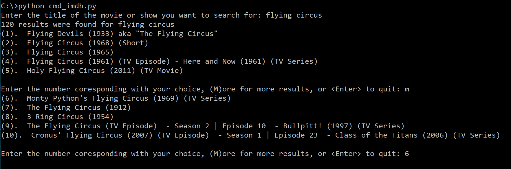
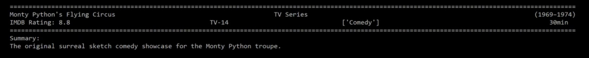

# Command Line IMDB
 A python script that allows you to look up movies and shows on IMDB from the command line

### Required Python Modules
This program requires two third party modules:

1. **requests** : A module for sending HTTP/1.1 requests using Python

2. **beautifulsoup4**: A module for parsing HTML and XML documents.

These modules can be installed by running the command `pip install requests beautifulsoup4` in the Command Prompt.

### Using The Program
Once the required modules are installed, navigate to the folder containing the script in the Command Prompt. The title being searched for can be given as an argument while calling the program, or can be entered once the program is running.

---
`python cmd_imdb.py Monty Python`

or

`python cmd_imdb.py` 
`Enter the title of the movie or show you want to search for: Monty Python`

---
When a search term has been provided, the program will output the number of results on IMDB for that term, and then give a numbered list containing the first 5 results. The user can then select from a result from the list by entering the corresponding number, request the next 5 results by entering m, or exit by hitting enter. The user is able to keep requesting more results until every result has bee displayed.

---
Once a result has been selected by the user, the program will output the title, media type, year(s) of release, IMDB rating, parental rating, genre(s), runtime, and synopsis of the selected result.

